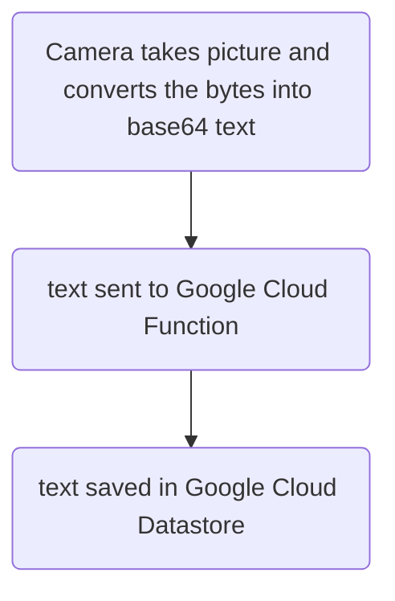
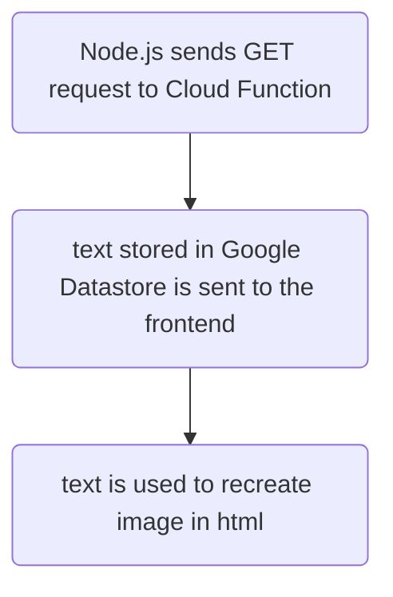

# esp32cam_spycam

So, I got an ESP32-CAM recently (early 2023), and eventually decided to set it up as a sort of security camera.  The outline of how the system works is below:

### Camera-to-Database
1. ESP32-CAM (using Micropython), takes a picture every 60 seconds (though that interval is adjustable)
2. After taking the picture, it sends it (as a bytes object which has been converted to a base64 text string) to a Google Cloud Function endpoint
3. The Google Cloud Function 'wakes up', then (because it's a POST request), writes the text string (as well as the date and time) to Google Cloud Datastore

### Database-to-Frontend
4. When wanting to view the camera images, I navigate to a page (written in Node.js) which I've deployed on Google App Engine.  The page is login-protected, so only certain people can access it.
5. Upon loading, the page sends a GET request to the same Google Cloud Function endpoint mentioned above.
6. Again, the Cloud Function wakes up, the (because it's a GET request), sends all the timestamps and associated base64 text strings (the images), to the front end
7. The images are loaded into a 'slider' on the frontend, where they can be scrolled through.

## Steps:

- Put all the code from `backend (for GCP Cloud Functions)` into a GCP cloud function,
- Put all the code from `frontend (for GCP App Engine)` into Google App Engine (Node.js), then
- Put all the code from `camera files (to write to the ESP32 cam)` onto your ESP32 cam (using Thonny, for example)

Again, the flow of this system is:

## Backend

## Frontend

It's a simple system that takes less than $20 USD to get up and running, and should have minimal overhead costs (as long as you don't perform millions of read-write functions to the database).

Thanks for reading!
